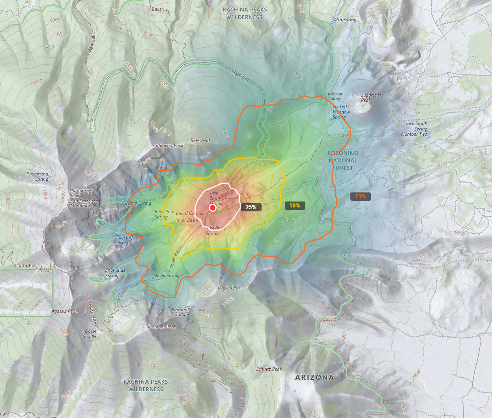

# WiSAR Decision Support Tool

**Terrain-Aware Range Rings (TARRs) for Wilderness Search and Rescue**

A web-based spatial analysis tool that generates anisotropic probability surfaces for SAR operations. Instead of drawing simple Euclidean distance rings around an Initial Planning Point (IPP), TARRs trace contours of equal travel cost across real terrain — stretching along trails and valleys where a person can move easily, and compressing against steep slopes, dense forest, and water barriers.

**Live site:** [https://sar.weleber.net](https://sar.weleber.net)



---

## What this tool does

Given an IPP (the point where a lost person was last seen) and a subject profile (hiker, child, dementia patient, etc.), the tool:

1. **Downloads geospatial data** — elevation (USGS 3DEP), land cover (NLCD 2021), trails and roads (OpenStreetMap), and hydrology (NHD)
2. **Builds a friction surface** — each 30m cell gets a cost multiplier based on land cover type, calibrated to off-trail speed literature (Imhof 1950)
3. **Computes anisotropic cost-distance** — Dijkstra's algorithm with per-edge Tobler's Hiking Function, cross-slope penalty, and 3D surface distance
4. **Generates probability contours (TARRs)** — Lost Person Behavior percentiles (Koester 2008) applied to the cost-distance surface to produce terrain-aware search area boundaries
5. **Ranks search segments by POA** — log-normal probability density integrated within CalTopo search segment polygons

## Key features

- **Two analysis modes:** IPP Only (single point + radius) and CalTopo Import (segments + auto-detected IPP)
- **28 subject categories** from Lost Person Behavior (Koester 2008) with eco-region and terrain selectors
- **Probability density visualization** with log-normal PDF color ramp (blue → red)
- **KML export** of TARR contours for CalTopo, Google Earth, QGIS, and Avenza
- **GeoTIFF downloads** of cost-distance, cost surface, and probability rasters
- **Segment POA rankings** normalized across defined search areas

## Architecture

```
app/
├── server.py              Flask web server and PNG renderers
├── pipeline/              Analysis pipeline (modular package)
│   ├── __init__.py        Public API re-exports
│   ├── shared.py          Constants, utilities, bbox functions
│   ├── downloads.py       Data acquisition (DEM, NLCD, OSM, NHD)
│   ├── cost_surface.py    Friction surface construction
│   ├── cost_distance.py   Dijkstra anisotropic cost-distance
│   └── outputs.py         Probability, POA, TARR contours
└── static/
    └── index.html         Single-page Leaflet.js frontend
```

## Data sources

| Data | Source | Resolution |
|------|--------|-----------|
| Elevation | USGS 3DEP (1/3 arc-second) | 30m |
| Land cover | NLCD 2021 | 30m |
| Trails & roads | OpenStreetMap (Overpass API) | Vector |
| Hydrology | NHD (USGS MapServer) | Vector |
| Subject profiles | Koester (2008), via Ferguson (2013) IGT4SAR | Statistical |

## Methodology

The cost-distance computation combines four factors per cell transition:

- **Tobler's Hiking Function** (directional slope cost)
- **Land cover friction** (calibrated to Imhof 1950 off-trail speed reduction)
- **Cross-slope penalty** (lateral traversal difficulty)
- **3D surface distance** (Pythagorean with elevation change)

Friction multipliers range from 1.0 (trail) to 1.8 (evergreen forest) to 50.0 (water barrier). The full friction table and methodology are documented in the tool's metadata panel.

## Tech stack

- **Backend:** Python 3.12, Flask, Gunicorn, Nginx
- **Frontend:** Leaflet.js, vanilla JavaScript (single-page app)
- **Geospatial:** rasterio, shapely, geopandas, scipy, rasterstats
- **Server:** Ubuntu 24.04 on Linode

## References

- Danser, R.A. (2018). *Applying Least Cost Path Analysis to SAR Data.* USC Thesis.
- Doherty, P.J., Guo, Q., Doke, J., & Ferguson, D. (2014). Applied Geography, 47, 99-110.
- Ferguson, D. (2013). IGT4SAR. GitHub.
- Imhof, E. (1950). *Gelände und Karte.* Eugen Rentsch Verlag.
- Koester, R.J. (2008). *Lost Person Behavior.* dbS Productions.
- Tobler, W. (1993). Technical Report 93-1, NCGIA.

## Author

**Jamie Weleber**
Coconino County Sheriff's Search & Rescue
Graduate Research — Northwest Missouri State University

## License

GNU AGPL3.0 License — see [LICENSE](LICENSE) for details.
